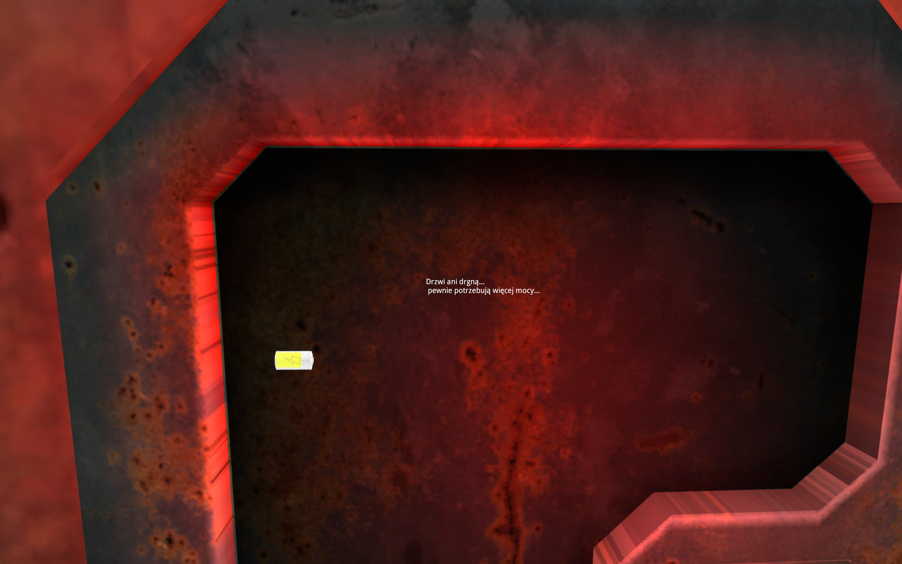
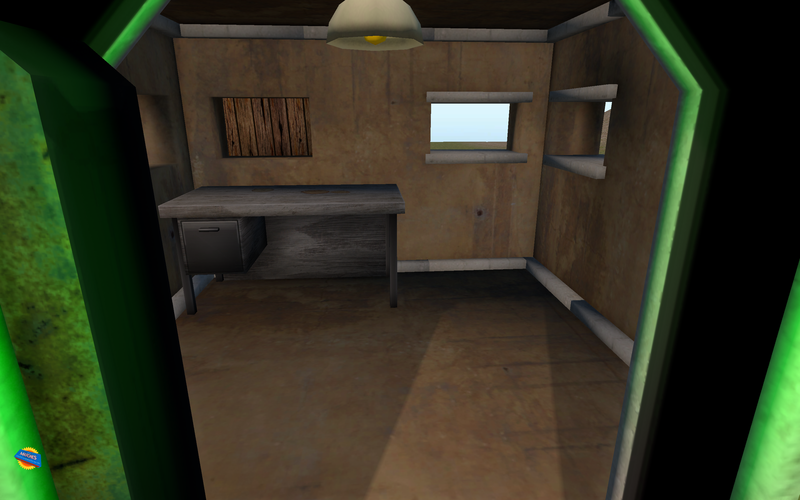

# Wyspa

Projekt gry 3D pierwszoosobowej stworzony w Unity, osadzony w klimatycznej scenerii wyspy. Gra wykorzystuje standardowe zasoby Unity oraz niestandardowe mechaniki do stworzenia immersyjnego doświadczenia eksploracyjnego.

## O projekcie

**Wyspa** to projekt gry FPS (First Person Shooter) z elementami eksploracji, który wykorzystuje Unity Engine do stworzenia interaktywnego środowiska 3D. Projekt zawiera zaawansowane mechaniki sterowania postacią, efekty wizualne oraz system fizyki.

## Główne funkcjonalności

- **First Person Controller** - zaawansowane sterowanie postacią FPP z mechanikami chodzenia, biegu i skakania
- **System fizyki** - interakcje z obiektami wykorzystujące Rigidbody
- **Efekty wizualne** - system cząsteczek, efekty wodne z odbiciami i refrakcjami
- **Cross-Platform Input** - obsługa wielu platform wejściowych (klawiatura, joystick)
- **Mouse Look** - płynne rozglądanie się myszką z regulowaną czułością
- **Head Bobbing** - efekt kołysania kamery podczas ruchu
- **FOV Kick** - dynamiczna zmiana pola widzenia podczas biegu

## Technologie

- **Unity Engine** (C#)
- Unity Standard Assets
- Unity Terrain System
- Unity Water System

## Struktura projektu

```
Wyspa/
├── Assets/
│   ├── Scripts/           # Własne skrypty (QuitGame, itp.)
│   ├── Standard Assets/   # Standardowe zasoby Unity
│   │   ├── Characters/    # Kontrolery postaci
│   │   ├── CrossPlatformInput/
│   │   └── Utility/       # Narzędzia pomocnicze
│   ├── Terrain/           # Zasoby terenu i wody
│   └── TutorialInfo/
├── ProjectSettings/       # Ustawienia projektu Unity
└── Packages/             # Pakiety i zależności
```

## Uruchomienie projektu

1. Sklonuj repozytorium:
   ```bash
   git clone https://github.com/kacperszczudlo/Wyspa.git
   ```

2. Otwórz projekt w Unity (zalecana wersja zgodna z ProjectSettings)

3. Załaduj główną scenę z folderu Assets

4. Naciśnij Play w edytorze Unity

## Sterowanie

- **WASD** - ruch postaci
- **Shift** - bieg
- **Spacja** - skok
- **Mysz** - rozglądanie się
- **ESC** - menu/wyjście z gry

## Status projektu

Projekt jest w fazie rozwoju. Zawiera podstawowe mechaniki rozgrywki oraz środowisko wyspy gotowe do dalszej ekspansji.

## Przebieg rozgrywki (screeny)

Poniżej krótka historia jednej sesji gry - od eksploracji bazy, przez minigierkę, aż po pościg wilka.

### 1. Start przy bazie

Na początku widzimy główny domek i ognisko. Gracz eksploruje teren i zbiera baterie potrzebne do uruchamiania kolejnych interakcji.


### 2. Komunikat o wymaganej liczbie baterii

Przy drzwiach pojawia się informacja, że potrzeba więcej mocy. To kieruje gracza do zadania pobocznego.



### 3. Minigra z kokosami

Gracz przechodzi do stanowiska treningowego i strąca kokosy/cele, aby odblokować nagrodę.


### 4. Nagroda po ukończeniu minigry

Po trafieniu wszystkich celów pojawia się bateria, którą można podnieść i wykorzystać dalej.


### 5. Otwarcie drzwi i zdobycie zapałek

Po zebraniu wymaganej energii drzwi dają się otworzyć. W środku gracz znajduje zapałki potrzebne do rozpalenia ogniska.



### 6. Rozpalenie ogniska

Po użyciu zapałek ognisko zaczyna płonąć i świat gry przechodzi do kolejnego etapu.


### 7. Finał - pościg wilka

Po wykonaniu celów aktywuje się zagrożenie: wilk zaczyna gonić gracza po otwartym terenie wyspy.


## Autor

**Kacper Szczudło** - [kacperszczudlo](https://github.com/kacperszczudlo)

## Licencja

Projekt wykorzystuje Unity Standard Assets, które podlegają licencji Unity Asset Store EULA.

---

*Projekt stworzony w ramach nauki game developmentu w Unity*
